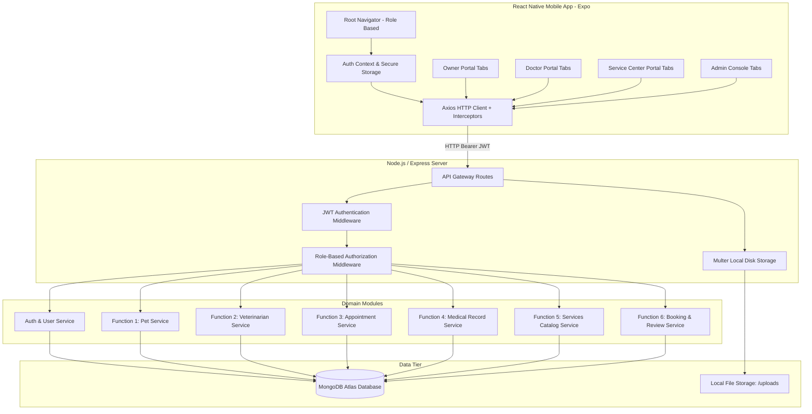

# 🐾 PetCare — Pet Healthcare & Services Management Mobile Platform

[](https://www.typescriptlang.org/)
[](https://reactnative.dev/)
[](https://nodejs.org/)
[](https://www.mongodb.com/atlas)
[](https://github.com/Dilshan-Pasindu/Pet-Care/actions)
[](https://jestjs.io/)

A full-stack, enterprise-grade mobile application built entirely in **TypeScript** to streamline veterinary care, clinical records, pet healthcare monitoring, service center reservations, and role-based administration.

---

## 📋 Table of Contents
1. [Platform Overview & Role-Based Portals](#-platform-overview--role-based-portals)
2. [Key Features & Workflows](#-key-features--workflows)
3. [Technology Stack](#-technology-stack)
4. [System Architecture](#-system-architecture)
5. [Domain Modules & Ownership](#-domain-modules--ownership)
6. [Repository Structure](#-repository-structure)
7. [Installation & Setup](#-installation--setup)
8. [Running Locally](#-running-locally)
9. [Automated Testing & CI/CD](#-automated-testing--cicd)
10. [API Reference Overview](#-api-reference-overview)
11. [Security & Validation Safeguards](#-security--validation-safeguards)
12. [Support & Administrative Contacts](#-support--administrative-contacts)

---

## 🌟 Platform Overview & Role-Based Portals

PetCare is structured into four distinct, role-dedicated portals that adapt the mobile interface to each user type:

```
                               ┌────────────────────────────────┐
                               │       PetCare Ecosystem        │
                               └───────────────┬────────────────┘
                                               │
      ┌───────────────────┬────────────────────┼────────────────────┬───────────────────┐
      ▼                   ▼                    ▼                    ▼                   ▼
┌──────────────┐   ┌──────────────┐     ┌──────────────┐     ┌──────────────┐    ┌──────────────┐
│ Public / Auth│   │  Pet Owner   │     │ Veterinarian │     │Service Center│    │Administrator │
│   Screens    │   │    Portal    │     │Doctor Portal │     │    Portal    │    │   Console    │
└──────────────┘   └──────────────┘     └──────────────┘     └──────────────┘    └──────────────┘
```

1. **🐶 Pet Owner / Customer Portal:**
   - Manage pet profiles with species, breed, gender, date of birth, weight, notes, and avatars.
   - Search veterinarians by specialization and clinic location with interactive map directions.
   - Schedule clinical consultations and book grooming, bathing, boarding, and daycare services.
   - Review complete medical histories, diagnosis records, prescriptions, and vaccination timelines.
   - Submit ratings and reviews (1–5 stars) for completed service center reservations.

2. **👨‍⚕️ Veterinarian (Doctor) Portal:**
   - Dedicated dashboard with daily appointment schedules, statistics, and patient counts.
   - Manage appointment statuses (`pending` ➔ `confirmed` ➔ `completed` / `cancelled`).
   - Access pet medical histories and document clinical diagnoses, treatments, medications, and vaccines.
   - Configure clinic profile, availability schedules, consultation fees, and emergency contact info.

3. **🏢 Pet-Care Service Center Portal:**
   - Real-time dashboard tracking daily service bookings, revenue metrics, and customer reservations.
   - Manage booking lifecycle (`pending`, `confirmed`, `in_progress`, `completed`, `cancelled`).
   - Create, update, and publish service offerings (grooming, bathing, boarding, daycare, training).
   - Maintain service center business profiles, address details, and operating hours.

4. **🛡️ Administrator Console:**
   - Comprehensive user directory with quick filtering by role (`owner`, `veterinarian`, `service_center`, `admin`, `deactivated`).
   - Real-time screening and count of **Pending Veterinarian Verifications**.
   - One-click doctor verification (`Verify Doctor` / `Revoke Doctor`) linked to the practitioner's official registration number (`Reg. No`).
   - Instant account activation and deactivation controls.

---

## ⚡ Key Features & Workflows

### 1. Doctor Registration & Admin Verification Workflow
To protect animal health and prevent unauthorized clinical activities, veterinarians undergo a rigorous verification workflow:
- **Registration Requirements**: Doctors must supply their official Veterinary Registration Number (**`Reg. No`**, formatted with placeholder `No: XXXX`) during signup.
- **Submit Action**: Registration is submitted via the dedicated **SUBMIT** action.
- **Unverified Status by Default**: Doctor accounts are initialized with `isVerified: false`. No authentication token is issued upon registration, preventing unverified portal access.
- **No Direct Portal Access**: Doctors are redirected to the Login screen with an alert directing them to contact administration (`admin@gmail.com, no-0770101999`).
- **Sign-In Protection**: If an unverified doctor attempts to log in, the backend rejects the request with HTTP 403 Forbidden, and the mobile client displays a **Verification Pending** alert with administrative contact details.
- **Admin Verification Console**: Administrators filter pending doctors, inspect their submitted `Reg. No`, and verify or revoke credentials with a single click.

### 2. Strict Input & Phone Number Validation
- Phone numbers are validated to **exactly 10 digits** (`/^\d{10}$/`) across frontend and backend.
- The registration form features a numeric keyboard (`keyboardType="number-pad"`), a strict 10-character limit, and automatic non-digit stripping.
- Password and confirm password inputs enforce matching verification before enabling form submission.

### 3. Date Safeguards for Bookings
- Consultation appointments and service center reservations cannot be booked for past dates.
- Booking forms validate selected dates against current time boundaries, preventing invalid scheduling.

### 4. Warm Peach Medical Pet-Care Aesthetic
- Cohesive color scheme featuring warm peach (`#FF8C66`), pastel coral surfaces (`#FFF5F2`), mint accents (`#4ECDC4`), and clean typography.
- Engaging welcome onboarding screen with custom brand imagery and smooth micro-animations.

---

## 🛠 Technology Stack

### Mobile Client (Frontend)
| Technology | Version / Spec | Purpose |
|---|---|---|
| **React Native** | 0.73.6 | Cross-platform native mobile framework |
| **Expo** | ~50.0.14 | Development toolkit and device runtime |
| **TypeScript** | ~5.3.3 | Strict static type definitions across components and navigators |
| **React Navigation** | v6 (Stack & Bottom Tabs) | Role-based nested navigation with typed routes |
| **Lucide React Native** | ^0.359.0 | Icon system across tabs, cards, and action buttons |
| **Axios** | ^1.6.8 | HTTP client with automatic Bearer token injection |
| **AsyncStorage** | 1.21.0 | Persistent device storage for auth tokens and user data |
| **Expo Image Picker** | ~14.7.1 | Image selection for pet avatars and profile photos |
| **Safe Area Context** | 4.8.2 | Responsive insets handling across iOS and Android devices |

### Backend API
| Technology | Version / Spec | Purpose |
|---|---|---|
| **Node.js** | v18+ | JavaScript runtime engine |
| **Express.js** | ^4.18.2 | RESTful API server framework |
| **TypeScript** | ^5.3.3 | Typed backend services, controllers, and models |
| **MongoDB Atlas** | Cloud M0/M10 | Document database for records, users, and bookings |
| **Mongoose** | ^7.6.3 | Schema modeling and ODM |
| **JWT (jsonwebtoken)** | ^9.0.2 | Stateless authentication tokens |
| **bcryptjs** | ^2.4.3 | Salted password hashing (10 rounds) |
| **Multer** | ^1.4.5 | Multipart file uploads for pet avatars (`/uploads`) |
| **Joi / Validator** | ^17.13.3 / ^13.11.0 | Strict payload schema and parameter validation |
| **CORS & Morgan** | ^2.8.5 / ^1.10.0 | Cross-origin policy management and request logging |

### Testing & DevOps
- **Jest & ts-jest**: Unit testing suite for validation rules, role authorization, and health endpoints.
- **GitHub Actions**: Automated CI pipeline running linting, TypeScript compilation, and Jest tests on every push/PR.
- **Continuous Delivery**: CD pipeline with automated deployment workflows.

---

## 🏛 System Architecture



---

## 👥 Domain Modules & Ownership

| Domain Module | Primary Model | Key Capabilities |
|---|---|---|
| **Common Auth** | `User` | Registration, login, password encryption, JWT generation, doctor verification (`isVerified`), `regNo`. |
| **Function 1: Pets** | `Pet` | Pet registration, breeds, birth date, weight, health conditions, photo uploads. |
| **Function 2: Veterinarians** | `Veterinarian` | Directory search, specialization, clinic details, availability slots, `regNo`, verification status. |
| **Function 3: Appointments** | `Appointment` | In-clinic booking, scheduling conflicts prevention, past date blocking, appointment lifecycle. |
| **Function 4: Medical Records** | `MedicalRecord` | Clinical diagnoses, treatment notes, prescribed medicines, dosage, vaccination timelines. |
| **Function 5: Services** | `Service` | Pet services catalog (grooming, bathing, boarding, daycare, training), pricing, duration. |
| **Function 6: Bookings & Reviews** | `ServiceBooking`, `Review` | Service reservations, date validation, 5-star customer feedback, service center ratings. |

---

## 📁 Repository Structure

```text
PetCare/
├── .github/
│   └── workflows/
│       ├── ci.yml                          # Continuous Integration (build, type-check, tests)
│       └── cd.yml                          # Continuous Delivery automation
├── README.md                               # Project documentation
├── TEAM_FUNCTION_PLAN.md                   # Team milestones and functional responsibilities
│
├── backend/
│   ├── package.json
│   ├── tsconfig.json
│   ├── .env.example
│   ├── tests/
│   │   ├── health.test.ts                  # Server health & connectivity tests
│   │   ├── appointmentValidation.test.ts   # Date & strict 10-digit phone tests
│   │   └── roleAuth.test.ts                # Role-based middleware tests
│   └── src/
│       ├── server.ts                       # Entry point and HTTP server listener
│       ├── app.ts                          # Express application configuration & middleware
│       ├── config/
│       │   └── database.ts                 # MongoDB connection handler
│       ├── middleware/
│       │   ├── authMiddleware.ts           # JWT extraction and validation
│       │   ├── roleMiddleware.ts           # Role-based access control (RBAC)
│       │   ├── uploadMiddleware.ts         # Multer multipart disk storage
│       │   └── errorMiddleware.ts          # Centralized error handler
│       ├── types/
│       │   ├── express.d.ts                # Express Request user extensions
│       │   └── models.ts                   # Core TypeScript model interfaces
│       ├── common/authentication/
│       │   ├── user.model.ts               # User schema (roles, isVerified, regNo)
│       │   ├── auth.controller.ts          # Auth endpoints & verifyDoctor controller
│       │   ├── auth.routes.ts              # Route definitions (/api/auth)
│       │   ├── auth.service.ts             # Auth business logic and verification
│       │   └── auth.validation.ts          # 10-digit phone & vet regNo validation
│       └── functions/
│           ├── function1-pets/             # Pet profiles & photo management
│           ├── function2-veterinarians/     # Doctor profiles & registration numbers
│           ├── function3-appointments/     # Vet consultation bookings & date checks
│           ├── function4-medical-records/  # Prescriptions, diagnoses & vaccines
│           ├── function5-services/         # Service offerings catalog & pricing
│           └── function6-bookings-reviews/ # Service bookings & 5-star customer reviews
│
└── frontend/
    ├── package.json
    ├── tsconfig.json
    ├── app.json                            # Expo app configuration
    ├── App.tsx                             # Application bootstrap & provider wrap
    └── src/
        ├── constants/
        │   ├── colors.ts                   # Warm peach & mint color tokens
        │   └── config.ts                   # API URL resolution
        ├── context/
        │   └── AuthContext.tsx             # Authentication state, login & role storage
        ├── navigation/
        │   ├── RootNavigator.tsx           # Role-based routing & security guard
        │   ├── AuthNavigator.tsx           # Welcome, Login, Register stack
        │   ├── OwnerTabNavigator.tsx       # Pet Owner bottom tabs
        │   ├── VeterinarianTabNavigator.tsx# Doctor portal bottom tabs
        │   ├── ServiceCenterTabNavigator.tsx# Service center bottom tabs
        │   └── AdminTabNavigator.tsx       # Admin console bottom tabs
        ├── screens/
        │   ├── auth/
        │   │   ├── WelcomeScreen.tsx       # Onboarding landing page
        │   │   ├── LoginScreen.tsx         # Sign-in & pending verification alert
        │   │   └── RegisterScreen.tsx      # Registration with Reg. No & 10-digit phone
        │   ├── admin/
        │   │   └── AdminManagementScreen.tsx# User directory, doctor verification & screening
        │   ├── veterinarian/
        │   │   ├── VetDashboardScreen.tsx  # Doctor statistics & quick actions
        │   │   ├── VetAppointmentsScreen.tsx# Manage appointment consultations
        │   │   ├── VetPatientsScreen.tsx   # Patient histories & clinical records
        │   │   └── VetProfileScreen.tsx    # Doctor profile & availability
        │   ├── serviceCenter/
        │   │   ├── ServiceCenterDashboardScreen.tsx # Bookings & metrics overview
        │   │   ├── ServiceCenterBookingsScreen.tsx  # Manage reservations
        │   │   ├── ServiceCenterServicesScreen.tsx  # Service catalog manager
        │   │   └── ServiceCenterProfileScreen.tsx   # Center profile & hours
        │   ├── home/HomeScreen.tsx         # Owner home dashboard
        │   └── profile/ProfileScreen.tsx   # User profile management
        └── functions/
            ├── function1-pets/             # Pet screens (List, Add, Edit, Detail)
            ├── function2-veterinarians/     # Vet directory & detail screens
            ├── function3-appointments/     # Appointment booking screens
            ├── function4-medical-records/  # Medical records & prescription viewer
            ├── function5-services/         # Services catalog screens
            └── function6-bookings-reviews/ # Service booking & review screens
```

---

## ⚡ Installation & Setup

### Prerequisites
- [Node.js](https://nodejs.org/) (v18.x or v20.x recommended)
- [npm](https://www.npmjs.com/) (v9.x or v10.x)
- [Expo Go](https://expo.dev/client) app installed on your physical mobile device, or Xcode / Android Studio for emulators
- A running MongoDB Atlas instance or local MongoDB server

### 1. Clone the Repository
```bash
git clone https://github.com/Dilshan-Pasindu/Pet-Care.git
cd Pet-Care
```

### 2. Backend Configuration & Installation
```bash
cd backend
npm install
cp .env.example .env
```
Edit `backend/.env` with your credentials:
```env
PORT=5000
NODE_ENV=development
MONGODB_URI=mongodb+srv://<username>:<password>@cluster0.mongodb.net/petcare?retryWrites=true&w=majority
JWT_SECRET=your_super_secret_jwt_key_at_least_32_characters_long
JWT_EXPIRES_IN=30d
```

### 3. Frontend Configuration & Installation
```bash
cd ../frontend
npm install
cp .env.example .env
```
Edit `frontend/.env` with your backend server URL:
```env
# For physical devices with Expo Go, use your local Wi-Fi IP address:
EXPO_PUBLIC_API_URL=http://192.168.1.100:5000/api

# For iOS Simulator:
# EXPO_PUBLIC_API_URL=http://localhost:5000/api

# For Android Emulator:
# EXPO_PUBLIC_API_URL=http://10.0.2.2:5000/api
```

---

## 🚀 Running Locally

### 1. Start Backend API
```bash
cd backend
npm run dev
```
- Server starts on `http://localhost:5000`.
- Verify server health at: `http://localhost:5000/api/health`.

### 2. Start Mobile Frontend
```bash
cd frontend
npx expo start
```
- Press **`a`** to launch on an open Android Emulator.
- Press **`i`** to launch on an iOS Simulator.
- Scan the displayed QR code with the **Expo Go** app on your physical mobile device.

---

## 🧪 Automated Testing & CI/CD

### Running Backend Unit Tests
The backend test suite is powered by Jest and validates schema validations, past-date booking rules, 10-digit phone restrictions, and role authorizations:
```bash
cd backend
npm test
```

### TypeScript Compilation Check
Verify type integrity across both frontend and backend without emitting build artifacts:
```bash
# Backend type check
cd backend && npx tsc --noEmit

# Frontend type check
cd ../frontend && npx tsc --noEmit
```

### GitHub Actions CI/CD Pipeline
Every commit and Pull Request pushed to `main` or `dev` triggers the automated CI workflow (`.github/workflows/ci.yml`):
- Runs backend and frontend linting.
- Executes full TypeScript type verification.
- Executes Jest test suites.
- Ensures zero regressions across critical authorization and validation paths.

---

## 📡 API Reference Overview

### Authentication & Users (`/api/auth`)
| Method | Endpoint | Access | Description |
|---|---|---|---|
| `POST` | `/api/auth/register` | Public | Register user (`owner`, `veterinarian`, `service_center`). Enforces 10-digit phone and `regNo` for vets. |
| `POST` | `/api/auth/login` | Public | Authenticate user; rejects unverified doctors with HTTP 403. |
| `GET` | `/api/auth/me` | Protected | Fetch authenticated user profile. |
| `GET` | `/api/auth/users` | Admin | Retrieve all system user records. |
| `PATCH` | `/api/auth/users/:id/status` | Admin | Activate or deactivate a user account. |
| `PATCH` | `/api/auth/users/:id/role` | Admin | Reassign a user's system role. |
| `PATCH` | `/api/auth/users/:id/verify-doctor` | Admin | Verify or revoke a veterinarian's credentials. |

### Pets (`/api/pets`)
| Method | Endpoint | Access | Description |
|---|---|---|---|
| `GET` | `/api/pets` | Owner / Vet | List pets owned by current user (or all for vet/admin). |
| `POST` | `/api/pets` | Owner | Register new pet with optional avatar photo upload. |
| `GET` | `/api/pets/:id` | Protected | Retrieve detailed pet medical & profile record. |
| `PUT` | `/api/pets/:id` | Owner | Update pet profile details and physical attributes. |
| `DELETE` | `/api/pets/:id` | Owner | Remove a pet profile. |

### Appointments & Consultations (`/api/appointments`)
| Method | Endpoint | Access | Description |
|---|---|---|---|
| `POST` | `/api/appointments` | Owner | Schedule a clinic visit (past dates rejected). |
| `GET` | `/api/appointments` | Owner / Vet | List appointments filtered by role. |
| `PATCH` | `/api/appointments/:id/status` | Vet / Admin | Update consultation status (`confirmed`, `completed`, `cancelled`). |

### Services & Bookings (`/api/services`, `/api/bookings`)
| Method | Endpoint | Access | Description |
|---|---|---|---|
| `GET` | `/api/services` | Public | Browse grooming, boarding, and daycare offerings. |
| `POST` | `/api/services` | Service Center / Admin | Create a service offering. |
| `POST` | `/api/bookings` | Owner | Book a pet care service (past dates rejected). |
| `PATCH` | `/api/bookings/:id/status` | Service Center | Update reservation progress. |
| `POST` | `/api/reviews` | Owner | Post a 1–5 star rating and review. |

---

## 🛡 Security & Validation Safeguards

1. **Strict 10-Digit Numeric Phone Rule**:
   - Phone fields strictly enforce `/^\d{10}$/`. Format variations or alphanumeric inputs are blocked at both client and server validation layers.
2. **Veterinarian Registration Gatekeeping**:
   - Doctor signups require an official Registration Number (`Reg. No`).
   - Doctor accounts default to unverified (`isVerified: false`) and are barred from portal navigation until approved by an administrator.
3. **Password Security**:
   - Passwords are encrypted with bcrypt (10 rounds) and excluded from query outputs (`select: false`).
4. **Role-Based Access Control (RBAC)**:
   - Routes and client navigators enforce strict separation between pet owners, doctors, service centers, and admins.
5. **No Past-Date Bookings**:
   - Both medical consultations and pet care reservations enforce date integrity checks prohibiting historical appointments.

---

## 📞 Support & Administrative Contacts

For veterinary verification requests, system inquiries, or credential reviews, please contact the administrative team:
- **Email**: [admin@gmail.com](mailto:admin@gmail.com)
- **Phone**: `0770101999`
